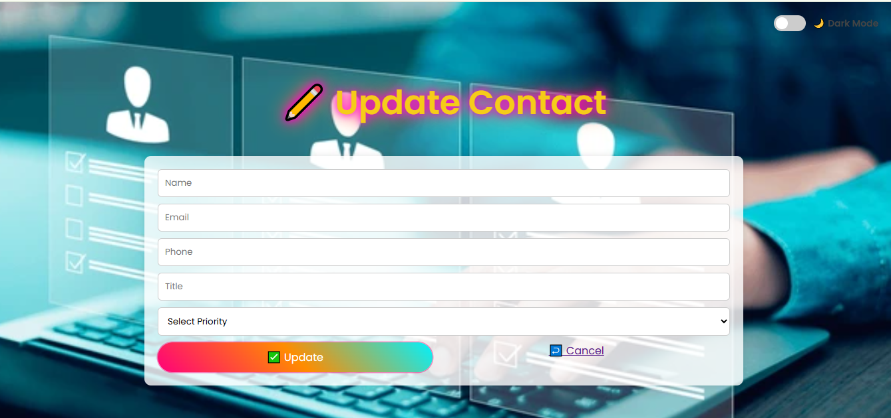
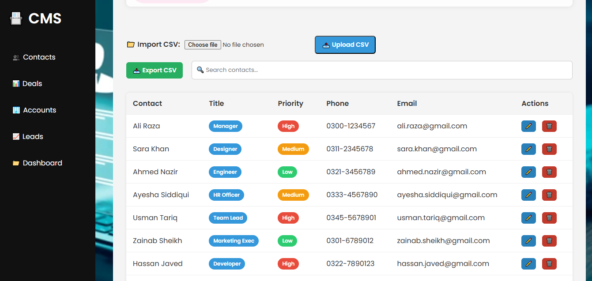
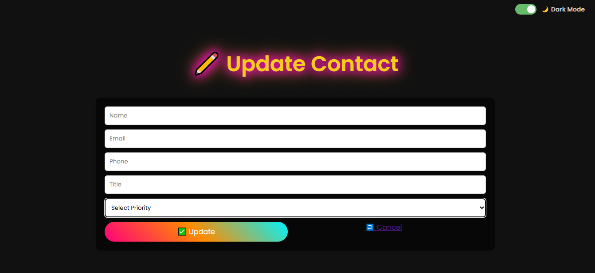
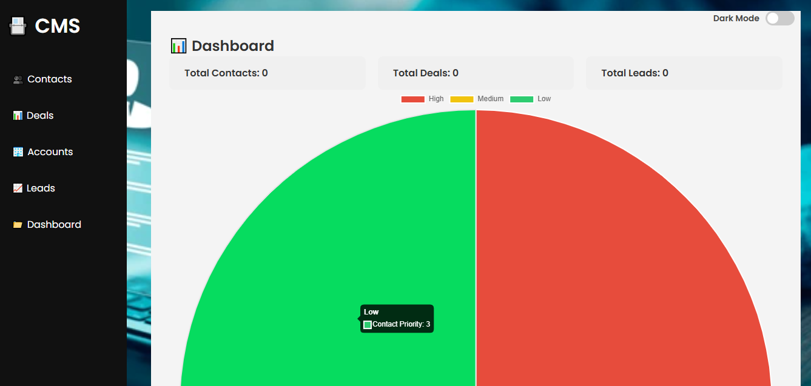
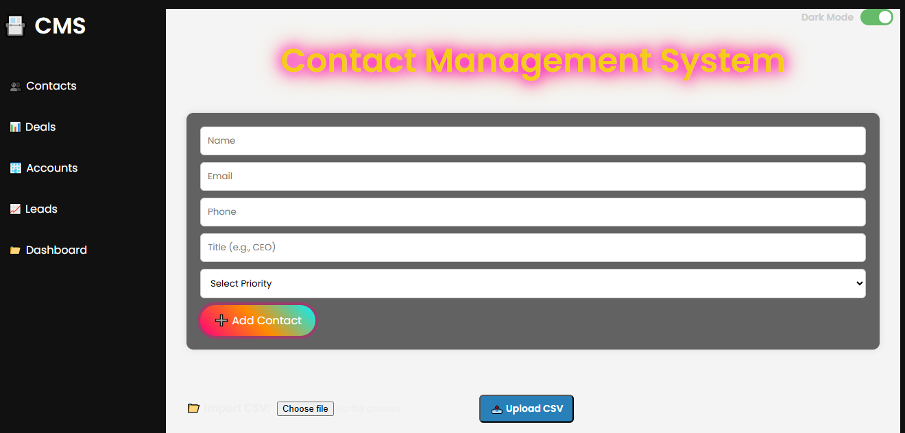

# 📇 Contact Management System

A professional **Flask-based web application** to manage personal or business contacts with a beautiful UI, animations, sidebar navigation, and powerful features like CSV import/export, dark mode, and priority-based filtering.

---

## 🚀 Features

🔹 Add, view, edit, and delete contacts  
🔹 Animated, responsive UI with glowing headers & styled sidebar  
🔹 Dark mode toggle with persistent theme  
🔹 CSV Export one-click backup of your data  
🔹 CSV Import bulk upload contacts from file  
🔹 Sidebar navigation to **Dashboard**, **Leads**, **Deals**, and **Accounts**  
🔹 Styled table with priority badges and hover effects  
🔹 Flash messages for real-time feedback  
🔹 Mobile responsive layout

---

## 🛠️ Built With

- **Python** (Flask)
- **HTML5 + CSS3**
- **Jinja2** Templating
- **SQLite3** + SQLAlchemy ORM
- **Chart.js** (for future dashboard visualization)
- **JavaScript** (for search filtering, dark mode toggle, charts)

---

## 📁 Project Structure

```
contact-management-system/
│
├── app.py                 # Main Flask application
├── instance/contacts.db    # SQLite database (auto-created)
├── templates/
│   ├── Add_exp_csv.png
│   ├── dark_mood.png
│   ├── Dashboard.png
│   ├── mainp.png
│   ├── u_dark.png
│   ├── update_contact.png
│
├── static/
│   ├── css/style.css      # All styles + dark mode + animations
│   └── images/            # Assets (background, logos)
│
├── templates/
│   ├── layout.html        # Shared base layout
│   ├── index.html         # Contact list & add form
│   ├── update.html        # Edit contact form
│   ├── dashboard.html     # Stats & chart placeholders
│   ├── leads.html         # Leads UI
│   ├── deals.html         # Deals UI
│   └── accounts.html      # Business accounts
│
├── contacts.csv           # Sample data for practice CSV import
└── README.md              
```

---

## 📸 Screenshots

### 📋 Contact Management System


### 📈 Update Contact


### 📥 CSV Import, Export and Add contact


### 🌙 Dark Mode View


### 📈 Dashboard Charts


### 🌙 Dark Mode of front



---

## 📦 Installation

```bash
git clone https://github.com/Asif-Ullah-dev/Contact-Management-System.git
cd contact-management-system
python -m venv venv
venv\Scripts\activate   # or source venv/bin/activate on Mac/Linux
pip install -r requirements.txt
python app.py
```

> Navigate to `http://127.0.0.1:5000/` in your browser

---

## 🧩 Future Enhancements

- 🧑‍💼 User login & registration system  
- 📊 Fully working charts dashboard  
- 🧾 PDF report generation  
- 🌐 Deployment on Render or PythonAnywhere

---


